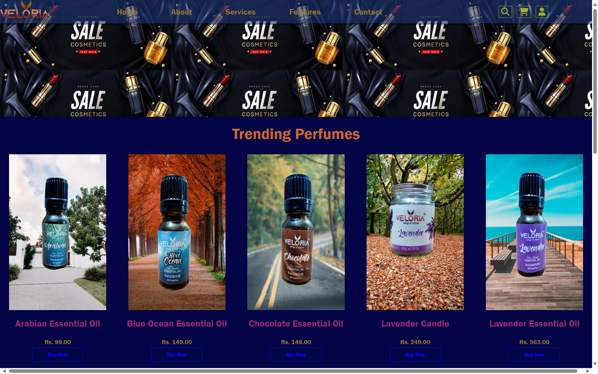
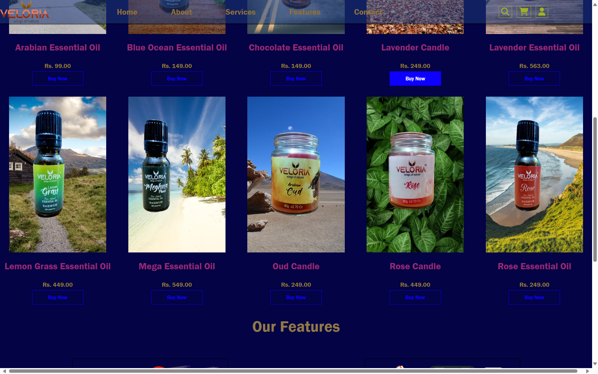
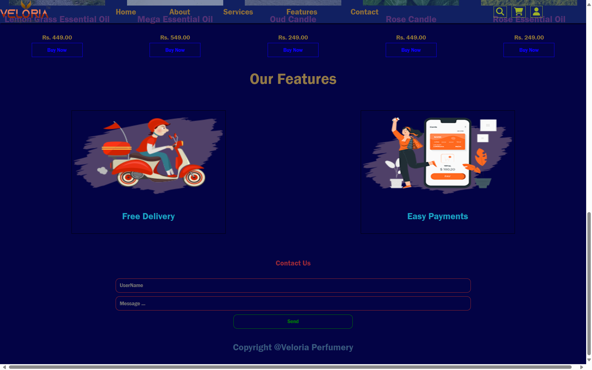

# Veloria Perfumery

1. A basic Landing Page of a perfume store.
1. Made with HTML CSS AND Javascript.
1. Responsive to different screen sizes using media queries.

## Features 🚀

1. Easy to Use.
1. User friendly.

## How to Use 🤔

1. Download or clone this repository onto your local machine.
1. Open `index.html` file located at the `./index.html` using a web browser.

## Preview This Project

## <a href="https://codequillcrafts.github.io/VeloriaPerfumery" target=_blank>View Live At Github</a>
## <a href="https://veloriaperfumery-codequillcrafts" target=_blank>View Live At Netlify</a>